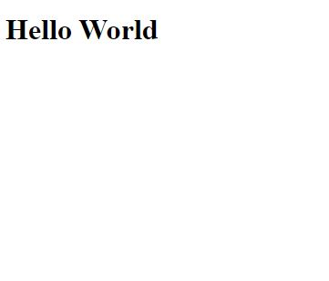

# Hello World

This repository contains the code for the Hello World programm implemented as an english version in html for our bachelor thesis.

# To try out the extension

Erstellen Sie eine Readme welche Ihrer Anwendung (inklusive Screenshot), die
Voraussetzungen und den Installationsvorgang beschreib
